# Catppuccin GitHub Profile Setup Guide

This guide will help you set up your beautiful Catppuccin-themed GitHub profile.

## 📋 Prerequisites

- A GitHub account
- Basic knowledge of Git

## 🚀 Setup Steps

### 1. Create a Special Repository

Create a new repository with **the exact same name as your GitHub username**.

For example, if your username is `johndoe`, create a repository named `johndoe`.

```bash
# Make sure the repository name matches your username!
```

**Important:** Make sure to check "Add a README file" or initialize it with a README.

### 2. Add Your Profile Content

1. Copy the contents from `README.md` in this folder
2. Paste it into your special repository's README.md
3. Replace the following placeholders:

   - `YOUR_USERNAME` → Your GitHub username
   - `[Your Name]` → Your actual name
   - `Your Location` → Your location
   - `Your Role` → Your job title
   - `YOUR_HANDLE` → Your Twitter/X handle
   - `YOUR_PROFILE` → Your LinkedIn profile URL
   - `your.email@example.com` → Your email
   - `PROJECT_1`, `PROJECT_2` → Your featured project repository names

### 3. Add Custom SVG Cards (Optional)

You can add the custom SVG cards to your profile:

1. Upload the SVG files (`profile-card.svg`, `info-card.svg`, `skills-card.svg`) to your repository
2. Add them to your README using:

```markdown
<div align="center">
  
</div>
```

Or reference them from your repository:

```markdown

```

### 4. Customize the Theme

#### Catppuccin Mocha Color Palette Used:

- **Base (Background):** `#1E1E2E`
- **Mantle:** `#181825`
- **Mauve (Primary):** `#CBA6F7`
- **Blue:** `#89B4FA`
- **Teal:** `#94E2D5`
- **Pink:** `#F38BA8`
- **Peach:** `#FAB387`
- **Yellow:** `#F9E2AF`
- **Green:** `#A6E3A1`
- **Sky:** `#89DCEB`
- **Text:** `#CDD6F4`
- **Subtext:** `#BAC2DE`

You can customize any colors in the badges or SVG files by replacing these hex codes.

## 🎨 Customization Options

### Change Tech Stack Badges

Edit the badges in the "Tech Stack" section. Use [shields.io](https://shields.io) format:

```markdown

```

Replace:
- `Technology` → Name of the technology
- `COLOR` → Catppuccin color (e.g., `CBA6F7`)
- `LOGO` → Logo name from [Simple Icons](https://simpleicons.org)

### Modify Stats Cards

The profile uses several stat cards:

1. **GitHub Stats:** Shows your overall statistics
2. **Streak Stats:** Shows your contribution streak
3. **Top Languages:** Shows your most used languages
4. **Trophies:** Shows your GitHub achievements
5. **Activity Graph:** Shows your contribution activity

All of these support the `catppuccin_mocha` theme parameter.

### Add More Sections

You can add additional sections like:

```markdown
## 📝 Latest Blog Posts

<!-- BLOG-POST-LIST:START -->
<!-- BLOG-POST-LIST:END -->
```

Then use [blog-post-workflow](https://github.com/gautamkrishnar/blog-post-workflow) to auto-update.

## 🔧 Advanced Features

### Auto-Update Profile

Use GitHub Actions to automatically update your profile with:

- Latest blog posts
- Recent activity
- Dynamic stats

Create `.github/workflows/update-profile.yml`:

```yaml
name: Update Profile

on:
  schedule:
    - cron: '0 */6 * * *'
  workflow_dispatch:

jobs:
  update:
    runs-on: ubuntu-latest
    steps:
      - uses: actions/checkout@v3
      - name: Update README
        uses: jamesgeorge007/github-activity-readme@master
        env:
          GITHUB_TOKEN: ${{ secrets.GITHUB_TOKEN }}
```

### Add Spotify Now Playing

```markdown
[](https://open.spotify.com/user/YOUR_SPOTIFY_ID)
```

Set up [novatorem](https://github.com/novatorem/novatorem) for this feature.

### Add WakaTime Stats

```markdown
[](https://wakatime.com/@YOUR_WAKATIME_ID)
```

Sign up at [WakaTime](https://wakatime.com) to track your coding time.

## 📊 Stats Services Used

- **GitHub Stats:** [github-readme-stats](https://github.com/anuraghazra/github-readme-stats)
- **Streak Stats:** [github-readme-streak-stats](https://github.com/DenverCoder1/github-readme-streak-stats)
- **Trophies:** [github-profile-trophy](https://github.com/ryo-ma/github-profile-trophy)
- **Activity Graph:** [github-readme-activity-graph](https://github.com/Ashutosh00710/github-readme-activity-graph)
- **Typing SVG:** [readme-typing-svg](https://github.com/DenverCoder1/readme-typing-svg)

## 🎯 Tips for a Great Profile

1. **Keep it updated:** Regularly update your skills and projects
2. **Be authentic:** Show your personality and interests
3. **Use high-quality images:** Optimize SVG files for fast loading
4. **Test locally:** Preview your README before committing
5. **Mobile-friendly:** Ensure it looks good on all devices
6. **Add GIFs sparingly:** They can be distracting if overused
7. **Link to your work:** Always link to your best projects

## 🐛 Troubleshooting

### Stats not showing?

- Make sure your profile is public
- Check that you replaced `YOUR_USERNAME` correctly
- Verify the repository name matches your username exactly

### Colors look off?

- Ensure you're using the correct Catppuccin Mocha hex codes
- Check if your browser supports the color format
- Try clearing your browser cache

### SVG not rendering?

- Make sure the SVG files are in the correct path
- Check that the file names match exactly
- Verify the SVG syntax is valid

## 📚 Resources

- [Catppuccin Theme](https://github.com/catppuccin/catppuccin)
- [Awesome GitHub Profile README](https://github.com/abhisheknaiidu/awesome-github-profile-readme)
- [GitHub Profile README Generator](https://rahuldkjain.github.io/gh-profile-readme-generator/)
- [Shields.io](https://shields.io)
- [Simple Icons](https://simpleicons.org)

## 💡 Examples & Inspiration

Check out these awesome Catppuccin-themed profiles:

- Search GitHub for `catppuccin profile` for more examples
- Browse the [Catppuccin Showcase](https://github.com/catppuccin/catppuccin#-showcase)

## 📝 License

Feel free to use this template and customize it however you like!

---

<div align="center">

**Made with 💜 and Catppuccin**

If you found this helpful, consider ⭐ starring the repository!

</div>
